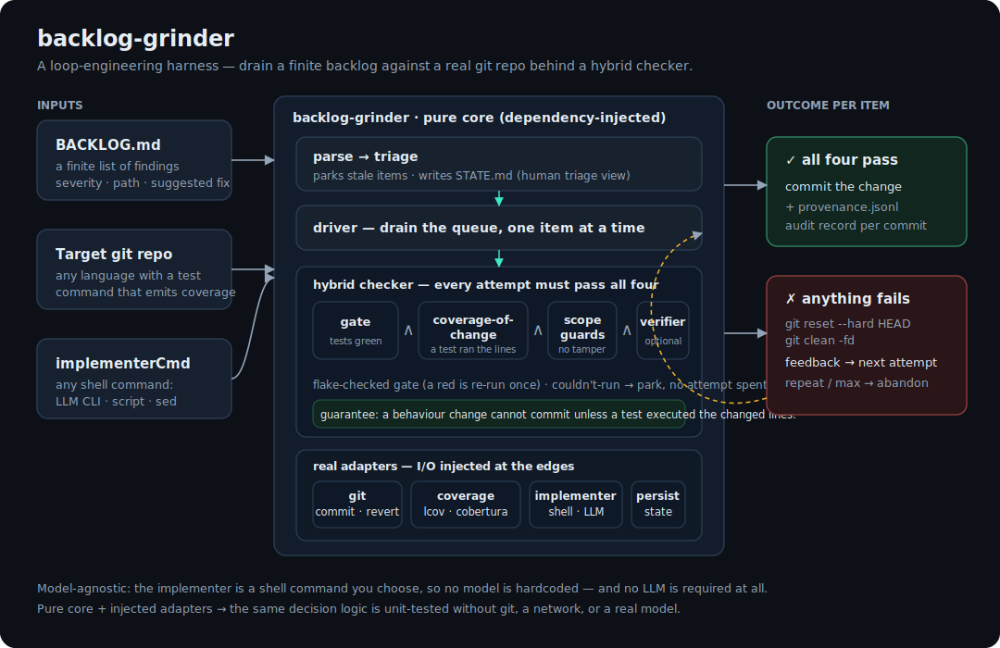
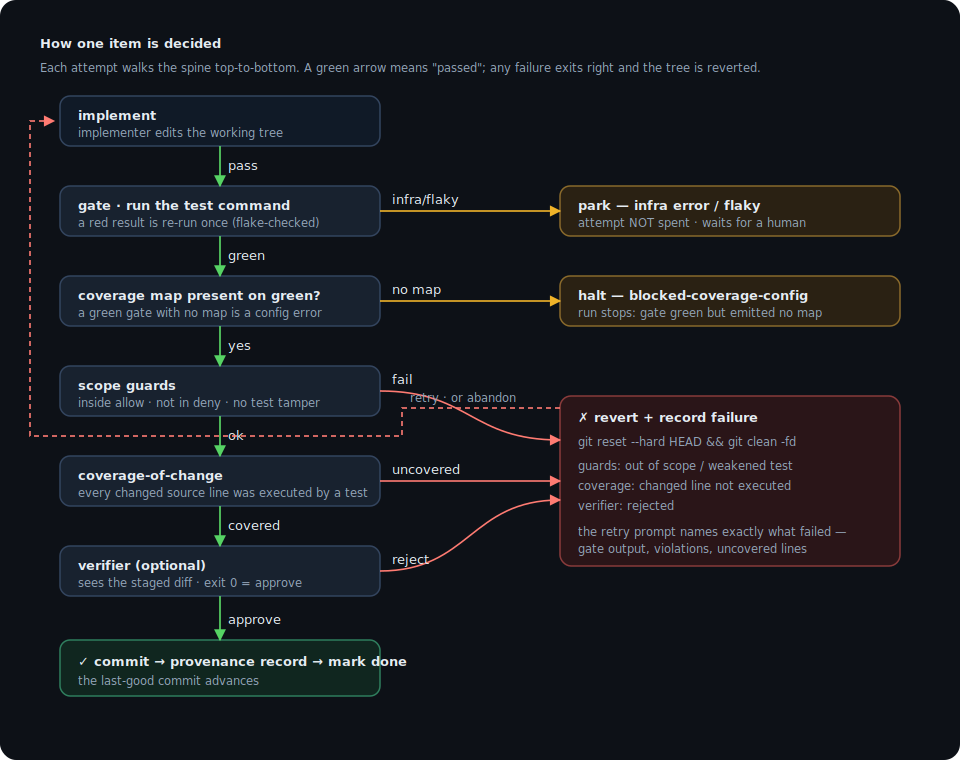
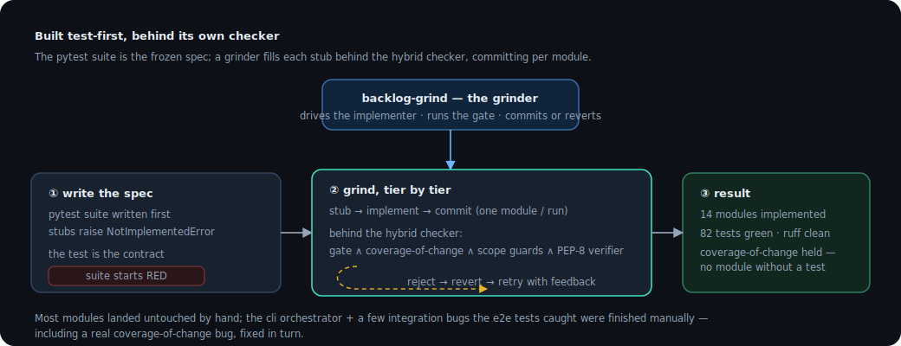

# backlog-grinder (Python)

<p align="center">
  
  
  
  
  
</p>

A **loop-engineering harness**: point it at a git repo and a finite backlog of findings, and it
drains the backlog one item at a time behind a **hybrid checker**. Every change must pass the
test gate, be *executed by a test* (coverage-of-change), survive scope/tamper guards, and clear
an optional verifier — or it is reverted and retried. No LLM is required; the implementer is any
shell command you choose.

> **The decisive guarantee is not "guards catch a crude cheat" but "a behaviour change cannot be
> committed unless a test executed the changed lines."** That defeats the delete-the-test cheat,
> the move-out-of-scope cheat, and the silent no-test fix in one stroke.

The idea: stop hand-prompting an agent to fix findings one by one. Hand it a finite, triaged
backlog and a checker it cannot talk its way past, then let it drain the list while you review the
provenance. The harness *is* the system; the model — if you use one at all — is just the
implementer you plug in.

## How it fits together

<p align="center">
  
</p>

The **core** is pure and dependency-injected — it makes every decision (parse, triage, drive,
gate, coverage, guard, verify) without touching git, a network, or a model. The **adapters** are
the only code that does I/O, and they are injected at the edges, so the entire decision logic is
unit-tested against fakes. The **implementer is a shell command**, so anything from `sed` to a
headless LLM CLI plugs in without the harness hardcoding a model.

## How one item is decided

<p align="center">
  
</p>

A couldn't-run or flaky gate **parks** the item without spending an attempt — a transient red
never throws away good work. On a real rejection the next prompt names *exactly* what failed
(gate output, guard violations, the uncovered lines), and a repeated identical failure abandons
early instead of burning every attempt.

## Requirements

- Python ≥ 3.9 and `git`
- A target repo whose test command can emit a coverage report (**cobertura/coverage.py XML** or **lcov**)

## Quick start

```bash
python3 -m pip install -e '.[dev]'      # pytest, pytest-cov, ruff
python3 -m pytest -q                     # the harness's own suite — 82 tests, no network, no model
ruff check backlog_grinder tests         # PEP 8

# grind a real repo
python3 -m backlog_grinder.cli --config grinder.json --repo /path/to/target
# or, once installed:  backlog-grind --config grinder.json --repo /path/to/target
```

`grinder.json`:

```json
{
  "backlog_path": "BACKLOG.md",
  "gate_cmd": "python3 -m pytest --cov=mypkg --cov-report=xml:coverage.xml --cov-fail-under=0 -q",
  "coverage": { "format": "cobertura", "file": "coverage.xml" },
  "implementer_cmd": "sh examples/claude-implementer.sh",
  "verifier_cmd": null,
  "allow": ["mypkg/"],
  "deny": ["mypkg/auth/"],
  "max_attempts": 3,
  "project_name": "My Service"
}
```

## Configuration

| Key | Meaning |
|---|---|
| `backlog_path` | markdown backlog, relative to `repo_cwd` (**required**) |
| `repo_cwd` | target git repo (default: cwd) |
| `gate_cmd` | test command — **must emit a coverage artifact** (**required**) |
| `coverage` | `{ "format": "cobertura" \| "lcov", "file": "coverage.xml" }` (**required**) |
| `implementer_cmd` | shell command that edits the tree to fix the current item (**required**) |
| `verifier_cmd` | optional; sees the staged diff, exit 0 = approve, non-zero = reject |
| `allow` / `deny` | scope guard: path prefixes the diff may / must-not touch |
| `max_attempts` | attempts before an item is abandoned (default 3) |
| `budget_seconds` | wall-clock budget; the loop halts and checkpoints when exceeded (0 = unbounded) |
| `stop_file` | touch this path to halt cleanly between items |

The implementer and verifier receive their context via environment, so any tool drops in:

| Variable | Given to | Meaning |
|---|---|---|
| `BG_ITEM_ID` / `BG_ITEM_TITLE` / `BG_ITEM_PATH` / `BG_ITEM_FIX` | implementer | the finding |
| `BG_PROMPT` | implementer | base prompt + prior-failure feedback |
| `BG_DIFF_FILE` / `BG_WARNINGS` | verifier | path to the staged diff + guard warnings |

`examples/claude-implementer.sh` is a ready headless-Claude implementer; `examples/verifier-pep8.sh`
is a verifier that runs `ruff` on each diff (style enforced per change). Swap in your own with
`IMPL='sh examples/my-implementer.sh'`.

## The backlog format

A markdown checklist — severity from `###` headings, category from `####`, one finding per `- [ ]`:

```markdown
### 🔴 CRITICAL (1)

#### bug-fix

- [ ] **make compute return 2**  ·  `src/x.py:2`  ·  _S/high_
    - _Evidence:_ compute returns 1 but the test expects 2.
    - _Fix:_ change the return to 2.
```

Each item gets a content-hash id. Items whose `path` no longer exists are parked as **stale**
(never auto-attempted).

## What it's good for

| Use case | Backlog source | Why the guarantee matters |
|---|---|---|
| Draining a static-analysis / audit report | findings exported to `BACKLOG.md` | each "fix" must ship with a test that runs it — no cosmetic patches |
| Burning down flaky-test or coverage-gap tickets | one item per file/function | coverage-of-change proves the gap actually closed |
| Bulk mechanical refactors behind a test suite | one item per call site | scope guards keep each diff to its file; nothing drifts |
| Unattended overnight fix loops | a triaged queue | parks the infra/flaky, abandons the stuck, commits only the proven |
| Porting / re-implementation, test-first | one item per module | exactly how **this** repo was built (below) |

Run it report-only first (a deterministic or no-op implementer), then graduate to an assisted
implementer, then to unattended — a phased **L1 → L2 → L3** rollout (report-only → assisted →
unattended) as your trust in the loop grows.

## Outputs, safety & resume

Everything lands under `<repo>/.backlog-grinder/`:

- **`STATE.md`** — human triage view (queue by severity, stale section, denylist flags)
- **`state.json`** — machine state for **resume**: re-running skips `done` items and restores the
  attempt/failure history of the rest
- **`provenance.jsonl`** — one append-only audit record per commit: prompt sent, gate output,
  coverage result, guard results, verifier verdict, final diff, commit sha. *"Why did the system
  make this edit and what did it check"* is answerable from disk.

**Git invariant:** every item starts on a clean tree at the last-good commit; a rejected attempt
reverts with `git reset --hard HEAD` **+ `git clean -fd`**; only an approved commit advances the
pointer. For unattended (L3) runs, give each item its own git worktree so `clean -fd` is scoped.
Add your coverage artifact and `.backlog-grinder/` to the target repo's `.gitignore`.

## End states (exit code)

- **complete** — every queueable item is `done` (exit 0)
- **drained** — nothing pending; the rest are `abandoned` / `parked` / `stale` (exit 0)
- **halted** — work remains: budget / `stop_file` hit, or a config error such as a green gate that
  emitted no coverage map (`blocked-coverage-config`) (exit 2)

## Built test-first, behind its own checker

<p align="center">
  
</p>

This package was built the way it runs. The pytest suite was written **first** as the frozen spec;
every module started as a stub raising `NotImplementedError`; then a grinder filled each one behind
exactly this hybrid checker — `gate ∧ coverage-of-change ∧ scope guards ∧ a ruff verifier` —
committing per module with provenance. Most modules landed untouched by hand; the `cli`
orchestrator and a few integration bugs the end-to-end tests caught were finished manually,
including a real coverage-of-change bug that was fixed in turn.

`scripts/grind.sh` is the per-module runner that drove it — and drives the same loop over any repo:

```bash
scripts/grind.sh                         # drive backlog-grind per module, tier by tier
scripts/grind.sh parse guards            # a subset, in dependency order
IMPL='sh examples/my-implementer.sh' scripts/grind.sh
```

## Library API

Everything is dependency-injected and importable:

```python
from backlog_grinder.parse import parse_backlog, is_stale
from backlog_grinder.triage import summarize, to_state_markdown
from backlog_grinder.driver import run_item, run_queue          # the loop
from backlog_grinder.guards import check_guards
from backlog_grinder.coverage import check_coverage
from backlog_grinder.coverage_adapter import load_coverage
from backlog_grinder.git_adapter import make_git
from backlog_grinder.persist import load_state, make_provenance_writer
from backlog_grinder.cli import run_grind                       # the orchestrator the CLI uses
```

## Design notes

- **Synchronous core.** Dependencies are ordinary callables and functions return values directly —
  no async, no event loop.
- **Plain dicts, snake_case keys.** Items, gate results, verdicts, and lessons are dicts
  (`gate_output`, `coverage_ok`, …) rather than objects.
- **Coverage is statement-aware.** For coverage.py/cobertura, non-executable changed lines
  (docstrings, blanks, multi-line-literal continuations) are treated as satisfied — only real
  statements gate a commit, while executable-but-unhit lines stay genuine coverage gaps.

## Limitations

- Coverage proves **execution, not assertion quality** — `assert True` padding still satisfies it.
  The assertion guard is a *count* (catches drops, not substitution). Closing that is the
  verifier's / a human reviewer's job.
- Scope (`allow` / `deny`) is **per-run**, not per-item.
- The implementer is only as good as the tool you wire in; the harness makes a bad edit *safe*
  (revert + retry), not *smart*.
- Best on repos with a fast, deterministic test+coverage command — a slow or flaky gate makes the
  loop slow or noisy.

## License

MIT.
